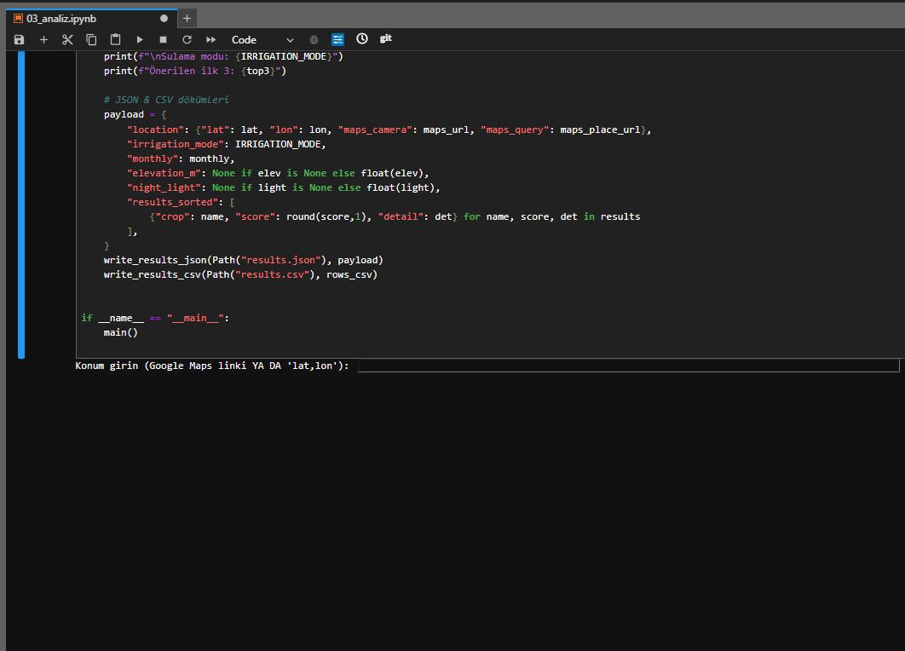
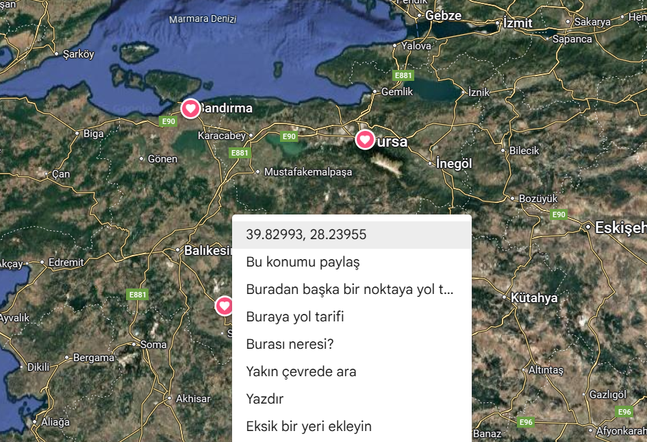
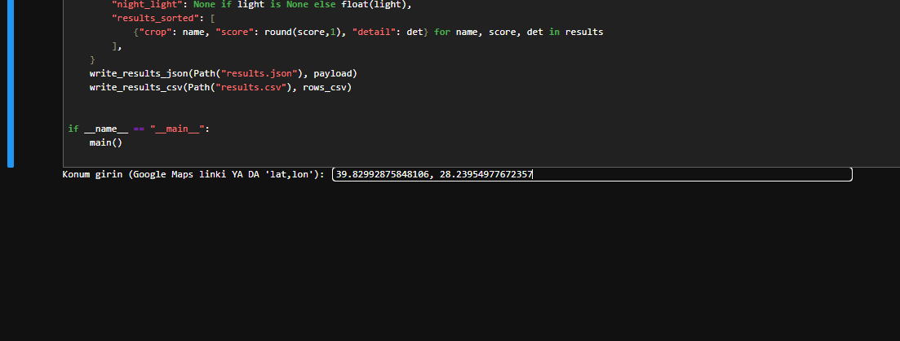
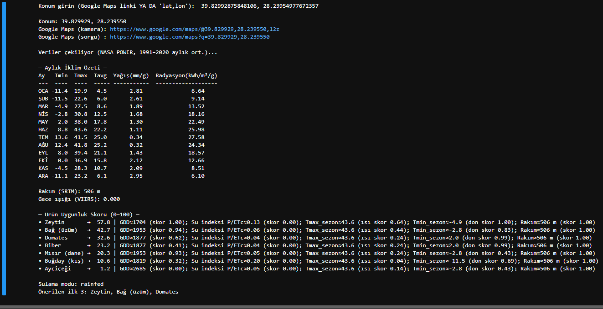
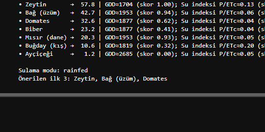

# Veri'm Gören (VerimGören) — Tarımsal Karar Desteği ve Proje Tanıtımı

**Kısa tarif:**  
Koordinat (`lat,lon`) gir → program otomatik **Google Maps linki** üretir → **NASA POWER** 1991–2020 aylık klimatoloji verisini çeker → **Hargreaves (FAO-56)** ile ET₀ hesaplar → pilot ürünler için **0–100** arası uygunluk skorları ve gerekçeler üretir.  
İsteğe bağlı olarak **SRTM rakım** ve **VIIRS gece ışığı** rasterlarından örnekleme yapılabilir.

> Bu repo bir **çalışan demo** + **proje tanıtımı**dır: Teknik kurulum ve kullanım adımlarının yanında, projenin amaç/etki/kurumsal modelini de içerir.

---

## Proje Özeti (Pitch)

**Proje Adı:** **Veri'm Gören (VerimGören)**

**Proje Özeti:**  
VerimGören, uydudan ve yerel kurumlardan alınan iklim/toprak verilerini sadeleştirerek **“doğru ürün – doğru yer – doğru zaman”** önerileri sunan dijital bir tarımsal yönlendirme modelidir. Sistem; sıcaklık, yağış, güneşlenme ve toprak nemi gibi göstergeleri yerel toprak bilgileri ve uzman görüşleriyle birleştirir, **parsel ölçeğinde anlaşılır tavsiyelere** dönüştürür. Mevsimsel/dönemsel değişimleri (geç don, sıcak hava dalgası, olağandışı yağış) takip eder; **ekim öncesi yönlendirme**, sezon içinde **sulama/bakım hatırlatmaları** ve **hasada yakın risk uyarıları** üretir. **DİGEM–belediye–STK–üniversite** iş birliğiyle sahadan erişir; **gençler ve kadınlar** için dijital okuryazarlık atölyeleri içerir.  
**Amaç:** Gereksiz su ve enerji kullanımını, yanlış gübrelemeyi ve deneme–yanılmayı azaltarak **üretimde istikrarı** güçlendirmek.

**Amacı & Motivasyon:**  
Her parsel için en uygun ürün desenini önermek ve bunu sezon boyunca güncelleyebilen bir **karar desteği** hizmetine dönüştürmek; su/enerji israfını önlemek, toprağın uzun vadeli sağlığını korumak ve yerelde tekrarlanabilir bir **dijital tarım modeli** geliştirmek. “**Veriyi görüp verimi görmek**” fikri, uzay tabanlı verinin sahadaki kararları iyileştirme gücünden doğdu.

**Hedeflenen Kurum/Ortaklar:**  
DİGEM (eğitim ve pilot yaygınlaştırma), belediyelerin tarımsal birimleri (saha koordinasyonu ve yerel eşikler), kooperatifler/STK’lar (kapsayıcı erişim ve geri bildirim), üniversiteler (bilimsel doğrulama ve gönüllü katılım). **Kamu–sivil–akademi** içinde **tekrarlanabilir** bir model.

**Toplumsal Fayda (çözdüğü sorunlar):**  
Doğru sulama takvimiyle **su/enerji tasarrufu** ve karbon emisyonunda azalma; **gübre optimizasyonu** ile toprak sağlığında iyileşme; kapsayıcı eğitimlerle **gençler ve kadınların** karar süreçlerine katılımı; kooperatif ağlarıyla **eşitlikçi ve şeffaf** yönetişim; yerelde **iklim dirençliliği** ve **refah artışı**.

---

## Hedefler ve Başarı Göstergeleri
- **Su/enerji verimliliği:** Sulama suyu/kWh’de **≥ %15** azalma  
- **Girdi doğruluğu:** Yanlış/abartılı gübrelemede **≥ %10** azalma  
- **Uyarı isabeti:** Don/sıcak dalgası uyarılarında **≥ %75 precision**, **≤ %20** yanlış alarm  
- **Kullanılabilirlik:** NPS **≥ 40**, öneri→aksiyon **≥ %30**  
- **Ölçeklenebilirlik:** Farklı ilçelere/ürünlere **hızlı yayılım**

---

## Sürdürülebilirlik, SKA Uyum ve Karbon Etkisi
- **SKA 2, 5, 6, 7, 9, 12, 13, 15** ile uyum.  
- **Karbon azaltımı kanalları:** Sulamada enerji tüketimi ↓, azot gübre kaynaklı **N₂O** ↓, gereksiz tarla operasyonları ↓, toprak organik karbonu ↑.  
- **Ölçüm-izleme (öneri):** Su (m³/ha) & enerji (kWh/ha), gübre (kg N/ha), operasyon sayısı (adet/ha), yakıt (L/ha), toprak organik C (%) → IPCC katsayılarıyla **CO₂e** envanteri.

---

## Saha Uygulaması ve Paydaş Modeli
- **DİGEM’ler:** Eğitim/yaygınlaştırma, çiftçiyle sürekli temas  
- **Belediyeler / İlçe Tarım:** Saha koordinasyonu, yerel eşikler  
- **Kooperatifler / STK’lar:** Çift yönlü geri bildirim, kapsayıcı erişim  
- **Üniversiteler:** Bilimsel doğrulama, içerik geliştirme, gönüllü katılım  
- **Kadınlar & Gençler:** Dijital okuryazarlık ve karar süreçlerinde görünür rol

---

## Sınırlamalar (Demo)
Bu paket **çalışan bir demo**dur; skorlar **basitleştirilmiş eşik/varsayımlara** dayanır. Tam üründe toprak profili, sulama etkinliği, çeşit ve sezon anomalileri dinamik şekilde entegre edilerek **kalibrasyon** yapılacaktır.

## Demo Kullanımı (Adım Adım)

Aşağıdaki görseller, uygulamanın **başlatmadan sonuç üretimine** kadar olan akışını sırayla göstermektedir.  

---

### 1) Konum girişi ekranı
Uygulama çalıştığında sizden **`lat,lon`** ya da **Google Maps konum linki** ister.  


---

### 2) Google Haritalar
Koordinatı **Google Maps** üzerinden bu şekilde alabilirsiniz. (**lat,lon** veya **link** yanlışsa çalışmaz.)  


---

### 3) Girdi
Değeri **doğru biçimde** girin ve onaylayın.  


---

### 4) İklim verisi ve hesaplamalar
Çalıştırınca uygulama **NASA POWER** klimatoloji verisini çeker; tabloda **Tmin/Tmax/Tavg**, **yağış**, **güneşlenme** vb. değerleri ve agrometeorolojik hesapları (**ET₀ – Hargreaves**, **GDD**, **P/ETc**, **ısı/don**) gösterir.  


---

### 5) Ürün uygunluk skorları (0–100) ve öneri
Her ürün için **uygunluk skoru** hesaplanır; bölgeye en uygun **ilk 3 öneri** listelenir.  


> Not: Görseller repo kökünde **`proje/image/`** klasöründedir. Yol farklıysa uygun şekilde güncelleyin.


---

## Teknik: Kurulum, Çalıştırma ve Çıktılar

**Gereksinimler**
- Python **3.9+**
- İnternet bağlantısı (NASA POWER için)
- (Opsiyonel) `rasterio` (TIFF rasterlardan piksel örneklemek için)

**Kurulum**
```bash
python -m venv .venv
# Windows
.venv\Scripts\activate
# macOS/Linux
source .venv/bin/activate

pip install -r requirements.txt
